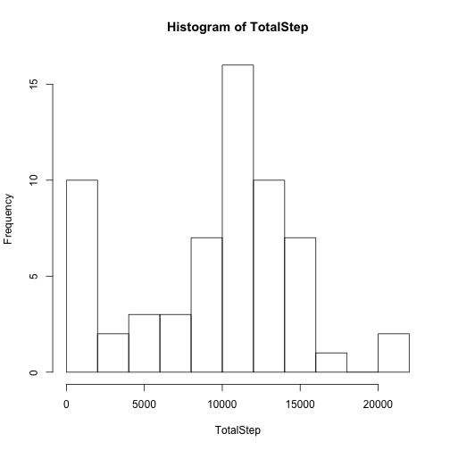
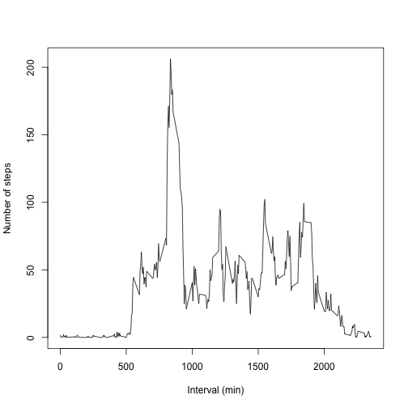
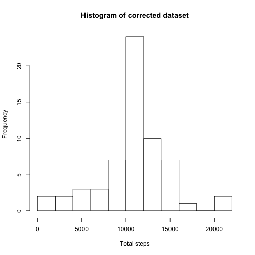
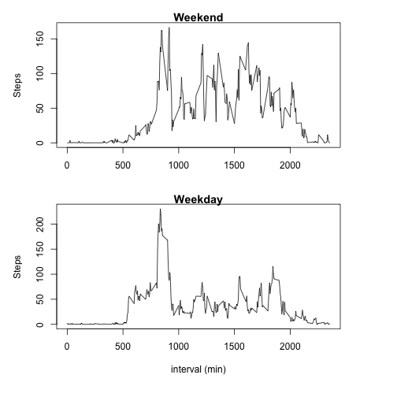

# Week 2 Assignment
## author : DB


### Loading and preprocessing the data:
1. Download the file and extract the zip

```r
url <- "https://d396qusza40orc.cloudfront.net/repdata%2Fdata%2Factivity.zip"
download.file(url, destfile = "AMonitor.zip")
unzip("AMonitor.zip")
```

2. Load the data

```r
data <- read.csv("activity.csv")
```


### Statistic of steps taken per day:
1. Split the data for each day.

```r
DaySplit <- split(data$steps, data$date)
```

2. Evaluate steps taken each day.

```r
TotalStep <- sapply(DaySplit, sum, na.rm=T)
```

3. Plot the histogram of step taken each day.

```r
hist(TotalStep, breaks=10)
```



4. .

```r
Mean <- mean(TotalStep, na.rm=T)
Median <- median(TotalStep, na.rm = T)
```
Mean and Median steps of each day are 9354.2295082 and  10395 respectively.


### Daily activity pattern:

Following code first makes the interval a factor and then calculates mean stepsin each interval. Finally it plots the average steps in each interval.


```r
data$interval <- factor(data$interval)
avgSteps <- sapply(split(data$steps, data$interval), mean, na.rm = T)
interval <- names(avgSteps)     #=== interval in minutes
plot(interval, avgSteps, type = "l", xlab="Interval (min)", ylab="Number of steps")
```



```r
Max <- interval[avgSteps==max(avgSteps)]
```
So, on average highest step taken between 835 and (835 + 5) minute.


### Imputing missing values:

Total number of missing values:

```r
table(is.na(data$steps))["TRUE"]
```

```
## TRUE 
## 2304
```

Filling missing values with that interval mean value from other days and writing new data file `dataMod`.

```r
dataMod <- data
naIndex <- is.na(dataMod$steps)
dataMod$steps[naIndex] <- avgSteps[as.character(data$interval[naIndex])]
table(is.na(dataMod$steps))
```

```
## 
## FALSE 
## 17568
```

Creating histogram with `dataMod`

```r
with(dataMod, hist(sapply(split(steps, date), sum), breaks= 10, 
                   main = "Histogram of corrected dataset",
                   xlab="Total steps"))
```



Calculating mean and median -

```r
mean(sapply(split(data$steps, data$date), sum), na.rm = T)
```

```
## [1] 10766.19
```

```r
median(sapply(split(data$steps, data$date), sum), na.rm = T)
```

```
## [1] 10765
```


### Activity pattern weekdays vs weekends:

Checking if the day is a weekday or weekend and the result is put into a new vector `Day`. Data are subsetted into `Weekday` and `Weekend`.

```r
Day <- weekdays(strptime(data$date, format="%F"))
Day[Day == "Saturday" | Day == "Sunday"] <- "Weekend"
Day[!(Day == "Weekend")] <- "Weekday"
Weekday <- dataMod[Day=="Weekday",c(1,3)]
Weekend <- dataMod[Day=="Weekend",c(1,3)]
Weekday.avg <- sapply(split(Weekday$steps, Weekday$interval), mean, na.rm = T)
Weekend.avg <- sapply(split(Weekend$steps, Weekend$interval), mean, na.rm = T)
```

Plotting the average steps in weekday and weekends:


```r
par(mfcol = c(2,1), mar=c(4,4,1,4), oma=c(2,1,1,1))
plot(interval, Weekend.avg, type = "l", main ="Weekend", xlab="", ylab="Steps")
plot(interval, Weekday.avg, type = "l", main ="Weekday", xlab="interval (min)", ylab ="Steps")
```




